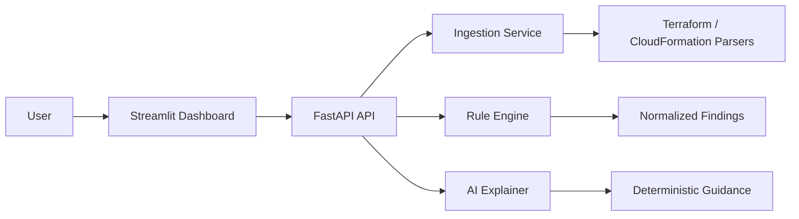

# Enterprise Security Guardrail Auditor


## Project Overview
The Enterprise Security Guardrail Auditor is an API-first, modular platform for reviewing Infrastructure-as-Code templates and surfacing actionable security findings. It combines a FastAPI backend, a rule engine, an offline AI explanation service, and a Streamlit dashboard to demonstrate the end-to-end workflow from template upload to remediation guidance.

## Features

- API-first architecture
- Terraform parser
- CloudFormation parser
- Security rule engine
- AI-powered remediation guidance
- Risk Score dashboard
- OpenAPI documentation
- SQLite persistence
- Streamlit dashboard
- Unit testing
- Structured logging

## Architecture Diagram


## Technology Stack
- FastAPI for the API layer
- SQLAlchemy with SQLite for local persistence
- Streamlit for the lightweight dashboard
- Pydantic models for request and response validation
- Structured logging and dependency injection

## Folder Structure
```text
app/
  api/
    dependencies/
    routes/
    schemas/
  core/
  domain/
    ai/
    models/
    rules/
    services/
  infrastructure/
    db/
    parsers/
  ui/
    dashboard.py
tests/
  unit/
```

## API Endpoints
- GET /health
- GET /ready
- GET /
- POST /uploads/parse
- POST /scan
- POST /explain

## Dashboard Screenshots
- Placeholder screenshot: 
## Dashboard

### Home


### Findings


- The dashboard displays upload, parsing, risk summary, findings, and explanation panels in a local Streamlit experience.

## Presentation
- A submission-ready presentation deck is available at [docs/presentation.md](docs/presentation.md).
- The deck is structured as a 12-slide narrative suitable for conversion to PowerPoint.

## OpenAPI Information
The FastAPI service exposes interactive API documentation at:
- /docs
- /redoc
- /openapi.json

## Installation

```bash
git clone https://github.com/manishdev92/enterprise-security-guardrail-auditor.git

cd enterprise-security-guardrail-auditor

python -m venv .venv

source .venv/bin/activate

pip install -r requirements.txt
```

## How to Run
1. Start the API:
   `uvicorn app.main:app --reload`
2. Start the dashboard:
   `streamlit run app/ui/dashboard.py`
3. Open the Streamlit UI at http://localhost:8501 and the API docs at http://localhost:8000/docs

## Testing Instructions
Run the regression suite with:
`python3 -m pytest -q`

## Future Enhancements
- Add persisted uploads and findings history
- Introduce richer rule coverage for AWS, Azure, and GCP
- Replace the mock provider with a pluggable integration layer while preserving the abstraction

## Cloud Resource Confirmation
No AWS or Azure infrastructure was provisioned. The application runs locally using FastAPI, Streamlit, and SQLite. Therefore, no cloud resources required decommissioning.

## Status
The backend foundation, ingestion pipeline, rule engine, AI explanation service, and dashboard UI are implemented and verified.

## AI-Assisted Development

This project was developed using GitHub Copilot following the Graduate Vibe Coding Challenge "Vibe Coding" workflow.

The complete AI interaction history is maintained in prompts.md.

## Tagle.ai Assessment

As part of the Graduate Vibe Coding Challenge, I completed the Tagle.ai assessment.

**AI Readiness Type:** **The Connector**

*"You bring people together to make AI work for everyone."*

This reflects my approach throughout the project: acting as the Lead Architect, guiding GitHub Copilot through iterative prompts, maintaining a complete prompt audit, and validating all generated code while preserving a collaborative AI-assisted development workflow.